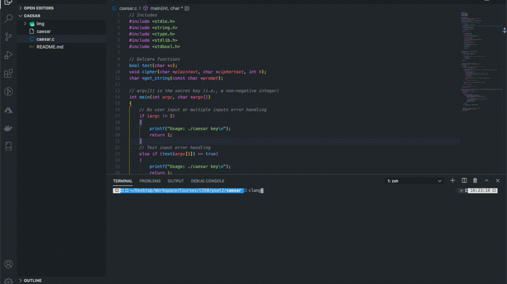

# Encryption: Arrays using C
### Homework from [Harvard's Introduction to Computer Science CS50 hosted on eDX](https://www.edx.org/course/cs50s-introduction-to-computer-science)
### 🎓 [Problem Set 2](https://cs50.harvard.edu/x/2020/psets/2/)
- [Caesar](https://cs50.harvard.edu/x/2020/psets/2/caesar/): Encryption by shifting each characters in each word that is inputted via command line
- I wrote most of the code in each file. No code was provided by the instructor.



## 💡Lessons Learned
- Working with [ASCII values](https://www.ascii-code.com/), which is one step above binary code (lowest level)
- Strings are an abstraction for an array of characters
- Applying knowledge of null terminating character at end of array of characters
- Copying arrays from one to another
- Adding command line arguments

## 🕹 How to Use
To run this project locally:
- In your terminal, navigate to the root directory of this project and run the following commands
```
$ clang -o caesar caesar.c
$ ./caesar 13
```
Where `13` is the number of ASCII values that your inputted text is shifted. In other words, it's the key to unlock the encryption.
The program will prompt you input your sample text after `plaintext:`
```
$ plaintext:  hello, world
```
The expected result for the above example is
```
$ ciphertext: uryyb, jbeyq
```

## 📝 Lecture Notes
- `printf("/n")` creates a new line

## 📣 Contributions
[MichealDim02](https://github.com/MichaelDim02)